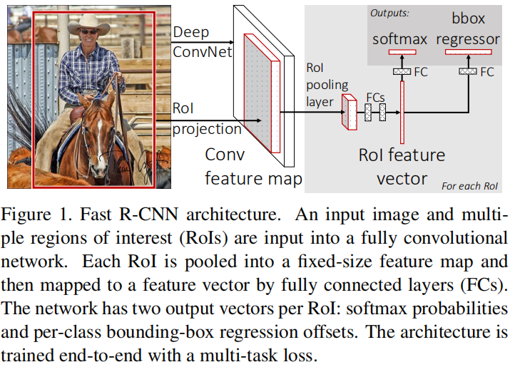

# Fast R-CNN

Ross Girshick, ICCV 2015

## 介绍

目标检测任务的复杂程度是相对较大的，主要表现在两个方面。首先，非常多的目标位置候选框必须要生成出来。其次，这些候选框仅仅提供了粗略的定位信息，需要进一步微调以达到更加准确的定位。解决这些问题，通常需要在计算速度、准确率、简便性之间综合考虑。

RCNN方法和SPPNet方法的模型训练都是多阶段的（CNN，SVM，Bounding-box Regressor）。由于对每张图片的每个候选框都需要提取特征进行计算，所以RCNN的训练和检测都非常慢。而SPPNet虽然使用了共享计算来加快每个候选框的特征提取，但是也是多阶段训练的。

本文提出了一种新的训练算法，该算法解决了R-CNN和SPPnet存在的问题，同时提升了它们的速度和准确率。其优点如下：
- 比R-CNN和SPPnet更高的检测质量（mAP指标）
- 训练是单阶段的，使用多任务目标函数
- 训练可以更新所有的网络层参数
- 不需要硬盘存储用作Feature caching

## 原理

Fast R-CNN架构如下图所示。模型将整张图片和一系列候选目标作为输入。模型首先处理整张图片，经过多层的卷积和池化得到一个特征图。然后，对每个候选目标，一个RoI (region of interest) pooling层可以从得到的特征图中提取固定长度的特征向量。每个特征向量接着经过几个FC层进行处理，然后作为分类器（FC + softmax）和回归器（FC + bbox-regressor）的输入。所以，模型对每个RoI都有两个输出向量：softmax概率（K个类+背景类），每个类的bbox回归偏移值（四个值表示bbox的位置）。



### RoI pooling layer

RoI定义为一个矩形框界定的感兴趣的目标区域，使用四元组(r, c, j, w)表示。和SPPnet中的处理方式类似，我们把任意尺寸h x w的RoI分为 H x W （固定的值）个格子，然后使用最大池化计算每个格子的响应值，最后得到固定大小的特征输入。不同之处在于，我们仅仅使用了一次固定输出大小的池化(7 x 7)。

### 使用预训练模型初始化

当一个预训练的网络初始化一个Fast R-CNN网络时，它需要经历以下三个过程：
- 首先，将最后一层的最大池化层使用一个RoI pooling层进行代替（H = W = 7 for VGG16）。
- 然后，网络最后的FC和softmax层使用两个分支网络代替（即前面描述到的分类器和回归器）。
- 最后，网络的输入修改为：图片，以及图片中的RoIs。

### 检测网络的微调

Fast R-CNN一个重要的能力就是它可以使用反向传播训练所有的神经网络参数。当每一个训练样本（RoI）来自不同的图片时，SPPnet的反向传播会非常低效。这种低效基于这样一个事实：每个RoI可能有很大的感受野，经常是占据整张图片的。因为前向传播必须要处理整张图片，那么训练的输入就会很大。

个人看法：一个Mini-batch里面，每个训练样本都是来自不同图片的话，对应就是不同的整张图片的输入，这样会造成重复的计算（为了得到当前模型下前向传播输出的特征图），这样会非常低效。

在Fast R-CNN中，我们使用了更加高效的训练策略。每个Mini-batch使用层级采样，首先选N张图片，然后从每张图片中选R / N 张RoIs。这样的话，来自同一图片的RoIs就可以在前向和反向传播的过程中共享计算和内存了。N较小时计算速度会很快，因为仅需要计算N张图的特征映射，R / N 个RoIs特征直接从对应图片的特征映射中提取就行了。

这个策略可能引起的一个担心是它会不会造成比较慢的收敛速度？毕竟RoIs都是来自同一张图片，每一次只有N=2张图片。实际上，我们使用了相比R-CNN更少的迭代次数达到了好的效果。

**多任务目标函数**

多任务的目标函数是单阶段训练中一个重要的支持部分，它即包含了分类器的目标函数，也包含了回归器的目标函数。（因为这里写公式不太方面，所以我把这部分比较重要的点列出在下面）
- bbox 回归器的输出值为每一类下候选框的位置，这个位置由(x, y, w, h)标识。x, y, w, h分别表示尺度不变性的转换和log空间高度宽度的平移（相对一个目标候选框位置来说）。这些值都是经过了0均值单位方差处理的。
- 回归器的目标函数使用了L1损失，它对离群点没有那么敏感（学习率调整相对容易）。
- 当RoI为背景框时，回归器的损失函数计算被忽略。

**Mini-batch采样**

Fine-tuning阶段，mini-batch所使用的参数为N = 2, R = 128。训练样本的所有RoIs中，25%的RoIs为正例样本（和真实目标框的IoU大于0.5），而75%的RoIs为负例样本（最大的IoU值在0.1到0.5之间）。训练阶段，图片以0.5的概率发生水平翻转，其余的数据增强技术均不涉及。

**经过RoI池化层的反向传播**

RoI池化层采取的是最大池化计算。假设输入该层的各个点为x_i，经过该层后输出为y_{r,j}，所以计算Loss对x_i的导数也比较简单（因为仅有一个最大池化运算）。

**SGD超参数**

分类器和回归器的FC层参数使用零均值的高斯分布进行初始化（标准差分别为0.01和0.001）。Bias被初始化为0。

> All layers use a per-layer learning rate of 1 for weights and 2 for biases and a global learning rate of 0.001. A momentum of 0.9 and parameter decay of 0.0005 (on weights and biases) are used.

### Fast R-CNN检测

在完成网络的fine-tuning后，测试阶段，网络只需要输入一张图片以及所有的候选框，就可以得到这些候选框属于每一类的概率，还有每一类下候选框应该的偏移量（refined bounding-box prediction）。对于每一个类，我们独立地使用非极大值抑制来得到最终的预测框及相应的概率值。

再测试阶段，很多时间都消耗在FC层的计算上（因为每个RoI对应的特征图都需要经过多个FC层的计算）。所以本文提出了SVD的方法来加速该部分计算（在不显著降低mAP的前提下），实验效果在原文中有所展示。（现在好像都是引入瓶颈层来减少计算量）

# Faster R-CNN: Towards Real-Time Object Detection with Region Proposal Networks

Shaoqing Ren, NIPS 2015

读完论文后，还是对整个网络的实现存在诸多困惑，特别是关键的RPN网络的具体实现，所以这里主要从实现的角度来回顾这篇论文。参考文章：https://www.telesens.co/2018/03/11/object-detection-and-classification-using-r-cnns/

下面从四个方面来全面解析Faster R-CNN。

## 图像预处理

在输入网络之前，图像都必须经过预处理。无论是在training还是test时，都需要经过相同的预处理步骤。
- 读入图片
- 减去均值（均值是一个3 x 1 的向量，每个数表示**这个通道下所有图片的所有像素点的均值**）
- 尺度伸缩，且原图的长宽比例保持不变（将图片的短边变换到600，但最大边长不超过1000）
- 输出预处理后的图片

尺度伸缩部分代码表示如下：
```python
def img_rescale(img, targetSize, maxSize):
	h, w = img.shape
	minDim = min(h, w)
	maxDim = max(h, w)
	scale_ratio = targetSize / minDim
	if(scale_ratio * maxDim > maxSize) scale_ratio = maxSize / maxDim

	img = rescale_image_by_ratio(img, scale_ratio)
```

## 网络

R-CNN网络使用神经网络去解决以下两个问题：
- 鉴别可能的区域（RoIs）
- 对每个RoI计算其属于每一类的概率

R-CNN有以下三种类型的网络构成：
- Head
- Region Proposal Network（RPN）
- Classification Network


R-CNNs一般使用预训练的head网络（如VGG16，ResNet50）去计算每张图的特征映射，用于提取图片中一些较为低级的特征。接着这些特征会被输入RPN（由一些卷积网络构成）中，然后产生RoIs。这些RoIs然后会被用来剪切出特征映射中的相应的区域。这个过程被称为"Crop Pooling"。被剪切处的特征区域会传给classification网络，用于对每个RoI进行分类。

## 模型训练

在介绍模型训练的细节之前，首先介绍一下后面不断会用到的概念。
- Bounding Box Regression Coefficients：R-CNN会产生很接近目标边界的候选框，通过把一个给定的边界框（由top left坐标以及边界框的高宽定义）作为参考，然后使用一系列的"Regression Coefficients"调整它的top left坐标以及高宽。T表示目标框，O表示原始的边界框。回归目标（将原始框转变成目标框的函数的值）如下：t_x = (T_x - O_x) / O_w, t_y = (T_y - O_y) / O_h, t_w = log(T_w / O_w), t_h = log(T_h / O_h)。注意，这样的回归系数的定义可以使得我们很容易地对目标框和原始框的位置进行相互转换。此外，更加重要的是，这样定义的回归系数是不受仿射变换的影响的。这一点对于计算Loss非常有用（因为RoI Pooling层的存在）。
- IoU = Intersection over Union

模型训练包含以下几个步骤：
- Anchor Generation Layer：该层用于生成固定数量的Anchors（边界框）。首先会生成9个Anchors（3 scales x 3 aspect ratio一组），然后在整个图像空间上均匀地平移这些Anchors来复制得到新的Anchors。每一组Anchors的中心点（中心区域=16 x 16）相同，对应head网络特征映射图（size=Channels x H/16 x W/16）中的一个位置。这样，我们知道了每个Anchor在原图的坐标，以及经过head网络后它们对应的特征图中的部分。
- Region Proposal Layer：
  - RPN：如上图模型架构所示，以head网络得到的输出（size=512 x H/16 x W/16）作为特征映射。然后经过1 x 1的卷积加一些reshape操作生成(H / 16 x W / 16 x 9, 4)的输出，表示每一行代表一个Anchor的边界框回归系数。另外，特征映射又经过1 x 1的卷积 + reshape + softmax 操作生成(H / 16 x W / 16 x 9, 2)的输出，表示每一行代表一个Anchor为正例和为背景的概率。
  - Proposal Layer：对于每个Anchor，使用其原图坐标及其RPN输出的边界框回归系数，得到其在原图空间中的预测框。然后使用这个Anchor为正例的概率值 + NMS算法对候选框进行剪枝，最终得到m个候选框。
  - Anchor Target Layer：这一层会计算RPN loss，使得RPN层可以更好地学习如何分辨每个候选框是否属于正例并且输出使其更加接近真实框的校正回归系数。RPN loss的计算可参考论文。
  - Proposal Target Layer：该层的目的是从Proposal层输出的m个候选框中选择更加精细的候选框（RoIs）。这些精细的RoIs将会被用来从特征图（特征图由head layer产生）中进行Crop Pooling，然后被传入网络剩余的部分来计算预测框的分数和框回归系数。
- RoI Pooling Layer：对于每个精细的RoI，该层会从head网络产生的卷积特征图中提取这个RoI对应的空间部分。
- Classification Layer：类似于Fast R-CNN中，经过RoI Pooling后，用于预测最终的边界框和框所属物体类别。同时也会计算损失函数，用来调整网络参数，最终得到更加准确的预测。


