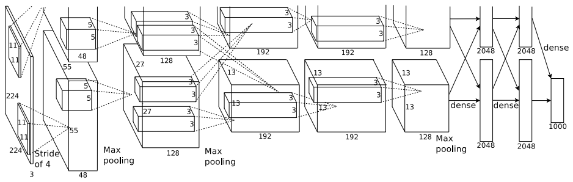

# AlexNet: ImageNet Classification with Deep Convolutional Neural Networks

## 背景

图像分类比赛：ILSVRC (Image Large-Scale Visual Recognition Challenge).

关于ILSVRC数据集：
- 为高分辨率图像数据，是ImageNet数据集的一个子集；
- 包括1000个类别，每个类别大约1000张；
- 训练集包括大约120万张图片，验证集包括大约5万张图片，测试集包括大约15万张图片。

图片处理：
- 图片裁剪到256 * 256的规格
- 0均值处理
- 227 * 227区域随机裁剪做数据增强

## 解决方法

**本文贡献**：在ILSVRC-2010和ILSVRC-2012比赛中使用的ImageNet数据子集上，我们训练了一个最大的CNN，并且取得了迄今为止最好的效果。关于这个CNN，总结如下：
- 对于训练神经网络中固有的二维卷积及其他操作，我们写了一个高度优化的GPU实现；
- 我们的网络架构包含了许多新的、不寻常的特性（提升了性能并且节约了时间）；
- 网络中使用了许多有效的技巧来避免过拟合；
- 我们的网络包含5个卷积层 + 3个全连接层。

**网络结构**
输入图形的规格为[227, 227, 3]。

**训练技巧**（按照重要性从高到低列出）

- 使用激活函数ReLU：f(x) = max(0, x)，收敛速度更快。
- 多GPU并行训练，更加快速。
- Local Response Normalization。对局部神经元的活动创建竞争机制，使得其中响应比较大的值变得相对更大，并抑制其他反馈较小的神经元，增强了模型的泛化能力。
- Overlapping Pooling。在CNN中使用重叠的最大池化。此前CNN中普遍使用平均池化，AlexNet全部使用最大池化，避免平均池化的模糊化效果。并且AlexNet中提出让步长比池化核的尺寸小，这样池化层的输出之间会有重叠和覆盖，提升了特征的丰富性（slightly more difficult to overfit）。

## 实验结果

ILSVRC-2010 测试集上的结果：

| Model | Top-1 | Top-5 |
|:-:|:-:|:-:|
|Sparse coding | 47.1% | 28.2% |
|SIFT + FVs | 45.7% | 25.7% |
| **CNN** | **37.5%** | **17.0%** |

