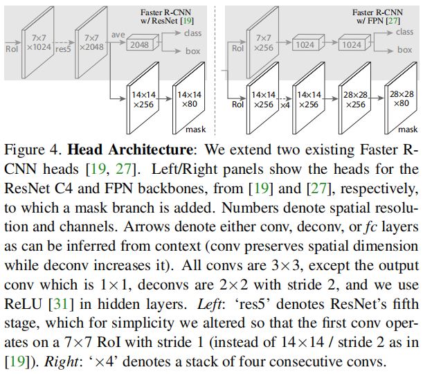
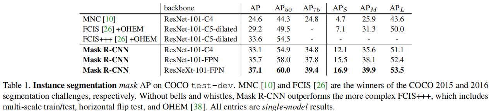
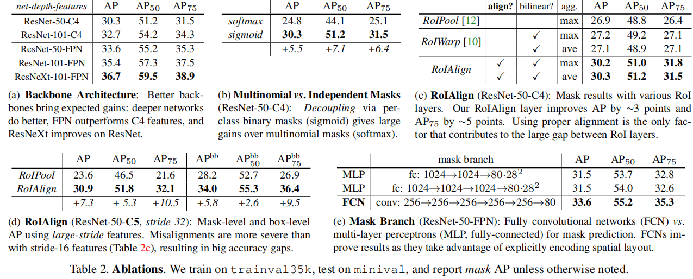
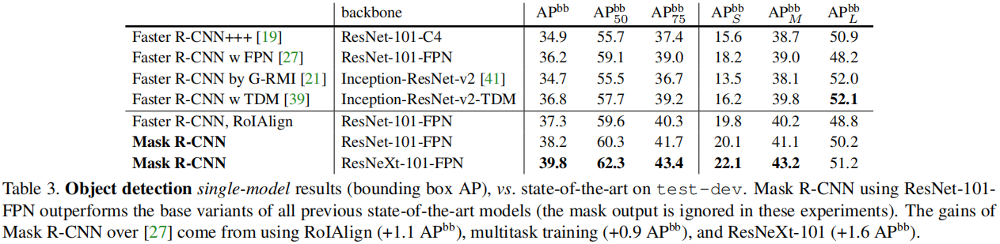

# Mask R-CNN

He et.al., ICCV 2017

## 介绍

计算机视觉中的目标检测及语义分割任务中，Fast/Faster R-CNN和FCN作为基准系统，大大促进了该领域的发展。这些方法概念上非常直观，并且有一定的灵活性和鲁棒性，同时具有较快的计算和推理时间。本文的目标在于为**实例分割**提供一个可以相比较的基准系统。

实例分割任务是非常具有挑战性的，因为它要求准确地检测一张图片中的所有目标实体，同时还要求精准地将每个实体分割出来。由此来看，语义分割其实结合了经典的计算机视觉任务 —— 目标检测，还有语义分割（无需区分物体实例，将每个像素点进行归类）。

我们的Mask R-CNN方法，对Faster R-CNN进行了拓展，增加了一个额外的分支用于对每个RoI进行Segmentation Mask预测，和已存在的分类和回归框分支并存。这个Mask分支是作用于每个RoI的一个小型的FCN，以Pixel-to-Pixel的方式预测一个Segmentation Mask。在给定的Faster R-CNN框架下，Mask R-CNN是很容易实现的。其次，Mask分支仅仅增加了少量的计算开销，使得构建高效快速的系统成为可能。

本质上来说，Mask R-CNN是一个对Faster R-CNN的直接的拓展，而合理的Mask分支的拓展对于好的检测性能来说非常重要。RoIPool提取的特征是粗糙的空间上的量化特征。为了去修正对齐，我们提出了一个简单的、无需量化的网络层，即RoIAlign，它完全地保留准确的空间位置。该网络层似乎只是一个很小的变化，但却有很大的影响：
- 大大地提升了Mask的准确性（10% 到 50%）
- 我们发现将Mask和class prediction解耦是必要的：我们对每个类别独立的预测一个二值的Mask，和类别没有竞争关系，具体的类别依赖Faster R-CNN框架中已有的RoI分类分支。反之，FCN对每个像素点进行多分类，融合了分割和分类任务，这样实际上对于实例分割表现比较差。

Mask R-CNN框架在COCO比赛中取得了SOTA效果。我们希望这个高效的系统，兼具灵活性和准确性的优势，可以**实例级别分割**提供参考。

## Mask R-CNN

在Faster R-CNN的基础上，添加一个分支用于生成Segmentation Mask。这个额外的Mask输出分支和类别输出、回归框输出是完全不一样的，它要求抽取出物体更加精细的空间布局。下面将介绍Mask R-CNN的主要内容，包括Pixel-to-Pixel的对齐，这是Faster RCNN的主要缺少部分。

**Mask R-CNN**：和Faster R-CNN一样，Mask R-CNN也分为两个阶段。Mask R-CNN的第一个阶段是RPN，和Faster R-CNN完全一样。第二个阶段并行地输出每个RoI的类别概率即边界框的位置，还输出一个每个RoI的Binary Mask。对于每个采样的RoI，训练阶段使用了多任务的损失函数：L = L_cls + L_box + L_mask。Mask分支对每个RoI，都有一个维度为Km^2的输出，在m x m的分辨率下的Mask值，每个对应K个不同的类。为了达到这个目的，我们对每个像素都是用了sigmoid函数，并且将L_mask定义为平均的二值交叉熵损失。对于一个真实标签为k的RoI，L_mask仅作用于第k个Mask，其他的Mask输出不会对loss值产生任何贡献。

我们的L_mask的定义使得网络生成每个类的Mask，而类之间不会产生竞争关系。在选择输出的Mask时，我们主要依赖分类网络的输出，这把Mask和class的预测解耦了。同时，这也是很多方法在使用FCN进行语义分割（每个像素点使用softmax得到其属于多个类别的概率）时忽略的关键点。所以，**将Mask和class的预测解耦也是Mask R-CNN预测性能较好的重要原因**。

**Mask Representation**：Mask对输入目标的空间布局进行了编码。提取Mask的空间结构可以通过卷积运算提供的Pixel-to-Pixel的响应很自然地处理。具体地，我们使用FCN从每个RoI中预测输出m x m的mask。这样可以维护目标物体的空间布局，而不是对它们铺平为向量然后使用FC层。

**RoIAlign**：要做到Pixel-to-Pixel的响应，我们需要RoI的特征能够很好地和每个像素的空间响应对齐。所以，我们使用了RoIAlign层来达到这个目的。根据RoIPool的原理，我们可以知道它用于生成每个RoI的特征图（如7 x 7的大小，计算的时候会使用取下界运算），这样会导致RoI图和提取的特征图之间出现misalignments（使用了两次取下界运算）。尽管这并不影响分类（对变换有鲁棒性），但它对预测每个像素的Mask却带来负面影响。

为了解决这个问题，我们提出了一个RoIAlign层，该层消除了RoIPool的苛刻量化，将提取的特征与输入正确对齐。具体地，我们在每个RoI bin里的四个固定的采样位置（保留浮点数），使用双线性插值去计算对应输入特征的准确值，然后对结果进行聚合（使用最大化或者平均化）。注意，结果与具体的采样位置和采样点的数量无关，只要不使用量化。

具体的解释和讨论可以参考：[here](https://www.cnblogs.com/wangyong/p/8523814.html)。

> 知道了RoiPooling和RoiAlign实现原理，在以后的项目中可以根据实际情况进行方案的选择；对于检测图片中大目标物体时，两种方案的差别不大，而如果是图片中有较多小目标物体需要检测，则优先选择RoiAlign，更精准些。

**Network Architecture**：

我们使用的Mask R-CNN模型框架区别在于：
- 用于提取整图特征的卷积backbone架构
- 用于边界框分类和坐标回归的网络的头部

Backbone的选择为ResNet或者ResNeXt，或者FPN（Feature Pyramid Network）。使用FPN作为backbone用于特征提取的Mask R-CNN在准确率和速度上都获得了很大程度的提高。

head架构的选择我们也使用了ResNet或者FPN，Mask分支使用了FCN网络，如下图所示。注意，我们的Mask分支使用了直接的结构，更加复杂的设计可能会提升模型性能，但这不是本文的关注重点。

关于训练和推理实验实现的细节，可以参考原文。但是更加推荐阅读源码：https://github.com/facebookresearch/Detectron

## 实验结果

分别给出COCO数据集上实例分割、Ablation、目标检测的结果，如下图所示。更多的实验结果及分析可通过原文查看。

