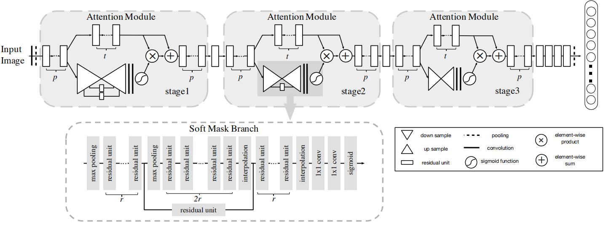
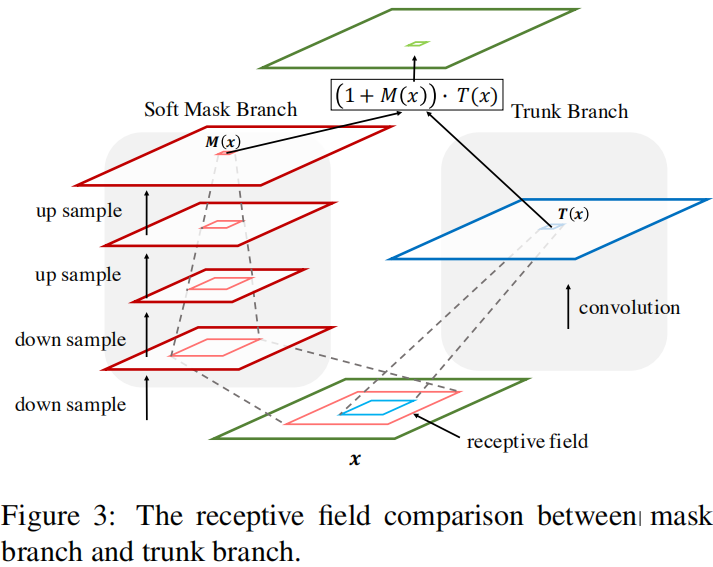
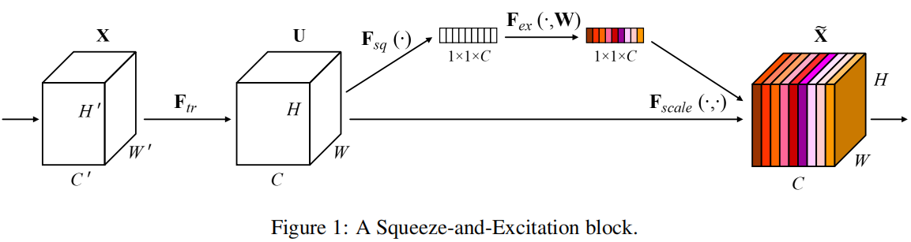
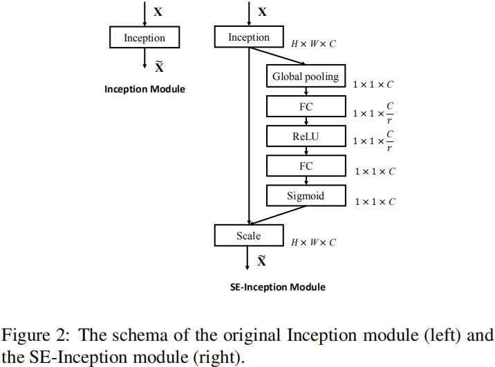
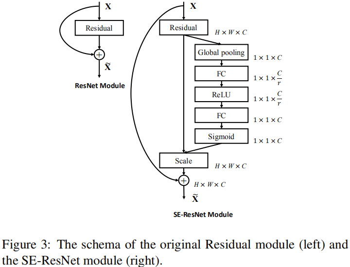
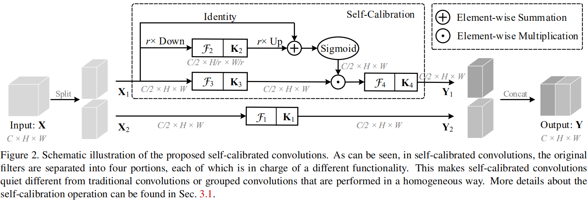

# ResNets Variants

The networks described below include these papers:
- Residual Attention Network for Image Classification (CVPR 2017)
- SENet: Squeeze-and-Excitation Networks (CVPR 2018)
- SCNet: Improving Convolutional Networks with Self-Calibrated Convolutions (CVPR 2020)

## Architecture

### Residual Attention Network

RAN（Residual Attention Network）可以使用多个Attention Module堆叠起来，最后以一种端到端的方式训练。每个Attention Module示意图如下：

下面对Attention Module的特点进行以下说明：
- 每个Attention模型被分为两个分支，mask branch 和 trunk branch。其中trunk branch用来做特征处理（输出为T(x)），可以使用任何模型来代替。本文使用了ResNet、ResNeXt、Inception作为基本网络单元来构建trunk分支。而Mask branch使用bottom-up top-down 结构去学习和T(x)相同尺寸的Mask用来对T(x)进行加权处理，即Attention mechanism。Mask branch结构类似于HighWay Network。
- 关于Mask Branch。在前向传播时，它可以当做特征Mask；反向传播时，它可以作为梯度更新的过滤器（由于梯度乘上了M(x)）。所以它可以让Attention模块变得更加抗扰动（有相应的实验证实）。每一层的Mask Branch都在提取这一层特有的Mask值，这在复杂的场景中特别有用。
- 由于M(x)是0-1内的小数，随着深度的增加，会不断地乘上M(x)，这会削弱深层的特征。所以我们使用了H(x) = (1 + M(x)) T(x)结构对网络进行了改进。最终，M(x)起到了提升特征表达以及抑制来自trunk特征的噪声（反向传播时）。
- Mask branch contains fast feed-forward sweep and top-down feedback steps。前面的feed-forward操作快速地收集了整张图片的全局信息，后面的操作将全局信息和原始特征映射进行结合。这两个步骤展开为自下而上，自上而下，完全卷积的结构。
- 论文尝试了三种不同的Attention模式，即对Mask Branch输出进行处理的三种不同方法：Mixed Attention （每个通道每个坐标点进行sigmoid运算）、Channel Attention（对每个坐标点沿着通道轴向进行L2正则化，X_{i,j}/||X||）、Spatial Attention（每个通道的特征图先进行标准化处理，然后进行sigmoid运算）。最终的实验结果表明Mixed Attention模式（不添加任何约束，自适应特征）更好。

实验结果：在CIFAR-10和CIFAR-100数据上，均是当前最佳效果。在ImageNet上，得到了和ResNet-200相当的效果，同时仅用了46%的深度和69%的FLOPs（浮点计算数，衡量模型的计算量、计算复杂度）。

## SENet

Squeeze-and Excitation Block是一个计算单元，它可以在任何转换后进行添加。文章主要考虑了常用的卷积运算带来的影响。一次单个卷积核的卷积运算会将所有通道上的值进行加权然后相加，导致了通道之间的依赖关系隐式地和核捕捉到的空间信息糅合在一起。所以，我们需要把这个通道之间的依赖信息和感受野捕捉到的空间信息进行解耦。本文的目标是对各个通道的信息进行加权，以保证网络对显著的特征更加敏感，而对无用的信息进行抑制。本文通过显式地对通道内部的依赖性进行建模来重新校正卷积之后的输出，步骤包括Squeeze和Excitation。示意图如下：

**Squeeze: Global Information Embedding**：

首先考虑输出特征中的每个通道。本文对每个通道生成一个Channel Descriptor，它包含了该通道下整个特征映射的全局信息。SENet使用了简单的AVGPooling，一方面运算简便，另一方面没有增加模型参数。

**Excitation: Adaptive Recalibration**：

然后考虑每个通道之间的内部依赖关系，最终得到一个自适应的Channel Weights。Excitation操作其实是在对通道之间的相互依赖关系进行建模，使用两个FC达到这个目的。两个FC中的一个用作瓶颈层，来减少计算量。

ResNet和Inception模型嵌入SE-Block后示意图如下：

实验结果见原文，使用了SE-Block的模型获得了ILSVRC 2017分类任务比赛的冠军。并且，`Significantly reduced the top-5 error to 2.251%, achieving a ∼25% relative improvement over the winning entry of 2016`.

## SCNet

重新考虑了卷积运算带来的不足：**一次单个卷积核的卷积运算会将所有通道上的值进行加权然后相加，导致了通道之间的依赖关系隐式地和核捕捉到的空间信息糅合在一起**。（SENet原文“Since the output is produced by a summation through all channels, the channel dependencies are implicitly embedded in Vc, but these dependencies are entangled with the spatial correlation captured by the filters.”）

SENet使用的是一种减少计算量的解耦方法，而SCNet重新思考卷积来解决这个问题。示意图如下：

个人**愚见**：
- 网络内部结构越来越复杂，没有像ResNet、DenseNet和SENet那样简约，是不是可以考虑某种**归约的运算**（在不显著减少模型性能情况下）？但是隐约觉得SENet就是这种归约运算（但是解决的着手点不同），这个点需要思考；
- 这项工作还有一个意义就是：We hope this work could provide future research with a promising way of designing novel convolutional feature transformation for improving convolutional networks；

## 最后

近来CVPR上关于视觉识别模型ResNet，DenseNet和SENet这三篇文章真的写地很好，表现在几个方面：
- 整体上的文章思路逻辑（不拖泥带水、没有过多的重复、突出重点），局部上语句、用词等都恰到好处并易于理解；
- 提供的作者自己的Insights和Intuition，这个对于理解模型本身相当重要，也可以提供阅读者思考方向；
- 相关工作的概括，一句话就能点到关键之处。
