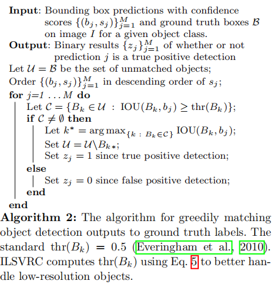

# ImageNet Large Scale Visual Recognition Challenge

## 介绍

本文有三个主要的目的：
- 讨论创建这样一个大规模的目标识别标准数据集存在的挑战
- 强调由我们的工作给目标分类和检测领域带来的进展
- 观察多类别目标识别领域的现状

对于意在创建大规模数据集的研究者，或者想了解大规模目标检测领域历史和现状的人，本文会有所帮助。

## 挑战任务

ILSVRC的目标是估计图像的内容，旨在达到恢复和自动标记的目的。

ILSVRC包含下列任务：
1. 图像分类（2010-2014）：算法识别图像中包含的目标的类别。
2. 单个目标定位（2011-2014）： 算法识别图像中包含的目标的类别，并且使用坐标对齐的矩形边界框来标记每个目标类别的**一个实例**的位置和区域。
3. 目标检测（2013-2014）：算法识别图像中包含的目标的类别，并且使用坐标对齐的矩形边界框来标记每个目标类别的**每个实例**的位置和区域。

## 大规模数据集构建

我们构建大规模的目标识别图像数据集包括三个主要步骤：
1. 定义目标类别集合。从ImageNet中选择已经存在了的目标类别。考虑了同义词消除，以及将相近的目标归为同一类别。自动启发式结合人工处理来创建目标类别集合。（`synset`表示属于同一类别的图像集合）
2. 收集多样的图片集合来表示选中的目标类别。自动结合手动的方式在多个搜索引擎中做图像收集。
3. 标注数百万的图片。对于每个单独的挑战任务，我们精心设计了众包策略。

## 大规模评估

### 图像分类任务

$error = \frac{1}{N} \sum_{i=1}^{N} min_j d_{ij}$。其中N表示图片数目；$d_{ij}$表示对第i张图片，算法给出的第j个预测是否错误。

Top-1 error评估的是算法给出预测概率最大的那个类是否错误匹配图像的真实标签，即j=1。hierarchical error，其中误分类代价$d(c_{ij}, C_i)$定义为预测类别与真实类别最近公共祖先的高度。

自从ILSVRC2012，我们仅仅使用top-5评估指标，因为它是最简单的，也是对数据集最适合的。

### 单目标定位任务

除了要求算法分类正确以外，还需要算法返回的实例检测框至少包含真实类的一个实例。

对于一张图片i，其真实类别为$C_i$，该类别的所有实例标记框为$B_{i,k}$。算法返回概率最大的5个类别$c_{ij}$及其对应的标记框$b_{ij}$。某个预测j的错误量化评估为：$d_{ij}=max(d(c_{ij},C_i), min_k d(b_{ij},B_{ik}))$。其中$d(b_{ij},B_{ik})$等于0，如果两个框的交集除以它们的并集（IOU）大于0.5，否则为1。

当一个图片中存在类别的多个实例时，为了评估的准确性，我们需要标记图片中所有的实例框，这可能不太实际。

### 目标检测

对于一张图片i的每个目标类别，算法给出的预测为$(b_{ij}, s_{ij})$，分别表示预测区域及置信度。对于算法给出的每个预测j，使用以下的算法来评估预测j是否正确，即得到$z_{ij}$。

对于一个特定的类别，N表示图片中属于该类别的所有实例的数目。使用召回率recall和准确率precision来评估算法的检测性能（仅看置信度大于阈值t的预测框）。关于AP预测指标，原文描述为：`The final metric for evaluating an algorithm on a given object class is average precision over the different levels of recall achieved by varying the threshold t.`

mAP是多个类别AP的平均值。这个mean的意思是对每个类的AP再求平均，得到的就是mAP的值，mAP的大小一定在[0,1]区间，越大越好。该指标是目标检测算法中最重要的一个。

注意，对于不同大小的人工标记框，IOU的阈值取值也不同。细节见原文。

### 方法

原文在这个章节主要介绍了从2010-2014年ILSVRC比赛中各个参赛者使用的方法。有兴趣的读者可以进一步了解。

有一句话很让人印象深刻（谈及AlexNet的影响）：

> This was a turning point for large-scale object recognition, when large-scale deep neural net-
works entered the scene. The **undisputed winner** of both the classification and localization tasks in 2012 was the SuperVision team (`AlexNet`).
