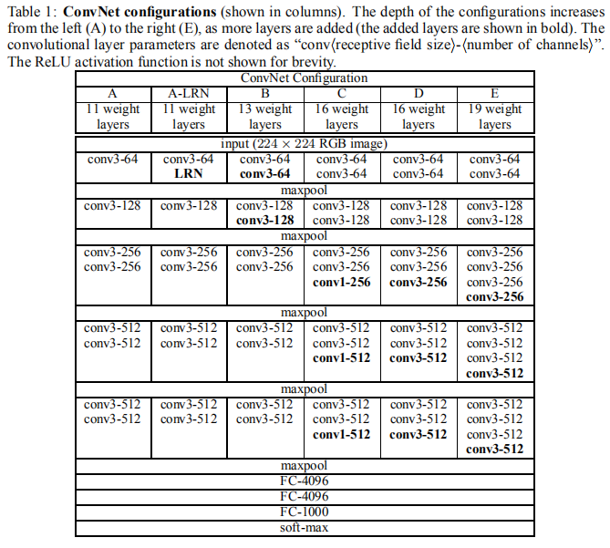

# Very Deep Convolutional Networks for Large-Scale Image Recognition

## VGGNet架构

训练阶段，网络的输入是一个固定尺寸224 x 224 的RGB图像。唯一的预处理就是，计算了训练集上的RGB均值，然后图片的每个像素都减去这个均值。我们使用了非常小的3 x 3卷积核，还使用了1 x 1卷积。卷积的stride步长设置为1，padding设置为1。

我们尝试了不同深度的网络，分别以A-E命名列出。下图给出了不同深度网络的基本情况。`conv3-256`表示一个卷积核为3 x 3，通道数为256的卷积层。网络E的参数数目为144M。

## 讨论

整个网络中，我们使用的卷积核大小为 3 x 3，而不是像其他经典的架构中使用7 x 7或者11 x 11的卷积核。我们为什么使用更小的卷积核呢？原因有两点：1. 3层 3 x 3的卷积叠加，每一层都含有非线性激活函数，而不是像1层 7 x 7的卷积只有一层非线性激活函数，这使得决策函数更加变得具有区分性；2. 参数更少，3层 3 x 3的卷积相比1层 7 x 7的卷积，节省了接近一半的参数。

还有，1 x 1卷积的使用增加了决策函数的非线性性，同时不需要更改卷积层的接受视野大小。

GoogLeNet和我们的网络都采用了更加深层的网络结构，但是细节不尽相同。在单个网络分类的准确性上，VGGNet的性能是超过GoogLeNet网络的。

## 训练

使用带动量的小批量梯度下降算法优化损失函数。我们在训练中还采用了L2正则化，dropout，提前终止等技巧避免过拟合。我们的网络虽然更深，同时含有更多的参数，但是它的收敛只要求较少的训练轮次。

网络权重的初始化非常重要，因为不良的初始化会由于深层网络中的梯度不稳定性而导致学习停滞。深层网络前4层网络权重，以及FC层的权值都是使用的预训练的A网络的权值进行初始化，而中间网络层使用标准正态分布初始化。

S是训练图像的最小边，训练尺度。Q是测试图像的最小边，测试尺度。对原始图片进行等比例缩放，使得S大于224，然后在图片上随机提取224x224窗口，进行训练。

单一尺度训练：固定 S 的大小，对应了单一尺度的训练，训练多个分类器。训练S=256和S=384两个分类器，其中S=384的分类器用S=256的权重进行初始化；

多尺度(Multi-scale)训练（尺度抖动）：直接训练一个分类器，每次数据输入的时候，每张图片被重新缩放，缩放的短边S随机从[256,512]中选择一个，也可以认为通过尺度抖动(scale jittering)进行训练集增强（*有利于捕捉多尺度的图形特征，而GoogLeNet使用不同大小的卷积核做到这一点*）。图像中的目标可能具有不同的大小，所以训练时认为这是有用的。

## 测试

在测试的时候，首先图片最小边的尺寸被缩放为Q（不一定非要和S相等）。之后，将网络转化为**全卷积网络**应用于全图（未裁剪）来实现**dense评估**。

当**全卷积网络**应用于全图时，我们就不需要在测试的时候对图片进行裁剪。同时，使用大的图片裁剪集可以提升准确率，因为它相比全卷积网络，对输入图片的采样更加合理。还有，多裁剪的评估是是对密集评估的一个有效补充。

下面三种评估方法均得到了应用：
1. 单尺度评估：测试图形最小边尺度Q固定，等于S或者等于(S_min + S_max) / 2；
2. 多尺度评估：测试图形最小边尺度Q不固定，有三种取值，{S-32, S, S+32}或者{S_min, 0.5(S_min+S_max), S_max}；
3. 多裁剪评估：我们在训练时统一使用尺度抖动，测试时图片使用多尺度，分别考查了多裁剪，Dense评估，多裁剪+Dense评估方法下，模型在测试集上的性能；

文章的实验结果显示：在网络E上，训练时使用尺度抖动，测试时图片使用多尺度，使用**全卷积网络**（全图为输入）得到分类评分，同时结合多裁剪方法，得到测试集准确率时最高的。

## 结论

引用原文最后一句话：
> Our results yet again confirm the importance of depth in visual representations.

关于全卷积网络，可参考LeCun团队在ImageNet目标定位任务上的最佳解决方案：OverFeat: Integrated Recognition, Localization and Detection using Convolutional Networks。