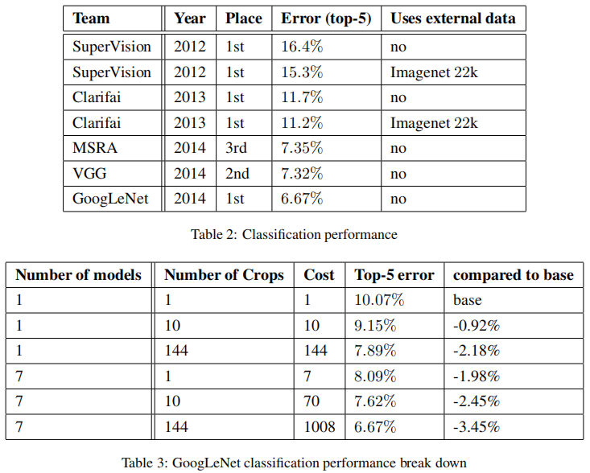

# Going deeper with convolutions

## 介绍

随着移动和嵌入式计算的不断流行，我们算法的效率越来越重要，特别是它们的能力和内存使用。值的注意的是，这也是本文给出的深度网络架构设计的出发点之一，而非执着于准确率数值。我们的模型被设计成在推理阶段保持1.5百万次的计算开销，所以它最终不是单纯为了满足学术好奇心的产物，而是可以以合理的开销用于实际应用的模型，甚至在大的数据集上。

本文，我们将重点关注计算机视觉中高效率的深度神经网络架构，即Inception模型，这个名字受Network In Network论文启发得到。

总体上，读者可以将Inception模型看作NIN网络的实现，同时从Arora等人的工作中获取的灵感和指导。Inception模型的性能通过ILSVRC-2014数据集测试，其效果明显超过了目前最好的方法。

## 相关工作

前文主要介绍CNN和AlexNet的工作。

值的注意的几点：
1. Serre等人提出的使用不同大小的滤波器来处理多尺度的问题，这点和Inception网络类似。
2. Network In Network是一种用于提升神经网络表达能力的方法。在CNN中，它可以被当作1 x 1的卷积加受限的线性激活函数。Inception模型很大程度上依赖这个方法。但是，在我们的实验中，1 x 1的卷积有另外一个对等的目的：通道数降维来移除计算瓶颈。
3. 当今目标检测领域领先的方法是R-CNN。我们在目标检测任务上，也采取了类似的两阶段流水线。

## 出发点和深层的考虑

最简单和保守的训练高质量网络的方式就是增加网络的深度和宽度，但是这会带来两个主要的问题。大规模的网络通常意味着大量的网络参数，这会导致网络容易过拟合，特别是在训练样本有限的情况下。另外，增加网络的深度或者宽度会大幅度地增加计算资源。

解决这两个问题的根本方法是最终从完全连接的架构过渡到稀疏的架构（**卷积层其实就是一个稀疏连接**）。Arora等人的工作提供了坚实的理论基础。当某个数据集的分布可以用一个稀疏网络表达的时候就可以通过分析某些激活值的相关性，将相关度高的神经元聚合，来获得一个稀疏的表示。

从以上的描述，我们可以找到一个方向：**在不显著损失性能的情况下，简化网络的拓扑结构是可行的**。

但是，现在的计算框架对非均匀的稀疏数据进行计算是非常低效的，主要是因为查找和缓存的开销。因此，作者提出了一个想法，既能保持滤波器级别的稀疏特性，又能充分密集矩阵的高计算性能。有大量文献指出，将稀疏矩阵聚类成相对密集的子矩阵，能提高计算性能。根据此想法，提出了Inception结构。

> 总结：这个地方一直看得有点迷糊，个人的理解就是，作者写这么大篇幅的目的是为了向读者介绍他们是如何一步步思考设计出Inception结构的，即该节标题中所指的Motivation。作者想解决的核心问题就是人们为了优化网络的性能增加网络的深度或者宽度的同时，如何保证模型的实用性（可接受的计算代价）。然后，Arora等人的理论工作给他们提供了这个信心。该理论工作指出，最优的网络结构可以使用Hebbian principle构建得到，即聚合那些有精密联系的神经元得到更加稀疏的网络结构（比如卷积层）。在卷积计算过程中，需要一些矩阵的计算，使用相对密集的子矩阵代替原稀疏矩阵可以提高计算性能。根据这一点，作者提出了在同一层使用多个不同尺度的卷积核来提高计算性能（使用1 x 1 加3 x 3的卷积来代替 5 x 5的卷积）。所以，最终有了我们所看到的Inception模型。

## 架构细节

下图是「原始」Inception 模块。它使用 3 个不同大小的滤波器（1x1、3x3、5x5）对输入执行卷积操作，此外它还会执行最大池化。所有子层的输出最后会被级联起来（各个卷积输出height x width相同，在通道数维度上进行叠加），并传送至下一个 Inception 模块。

如前所述，深度神经网络需要耗费大量计算资源。为了降低算力成本，作者在 3x3 和 5x5 卷积层之前添加额外的 1x1 卷积层，来限制输入信道的数量。尽管添加额外的卷积操作似乎是反直觉的，但是 1x1 卷积比 5x5 卷积要廉价很多，而且输入信道数量减少也有利于降低算力成本。不过一定要注意，1x1 卷积是在最大池化层之后，而不是之前。

## GoogLeNet

我们尝试过使用更宽或者更深的Inception结构，但其效果会稍微下降（更多的参数容易过拟合）。我们在比赛中使用完全相同的GoogLeNet结构训练了6个模型（集成模型总共包括7个），它们分别基于不同的数据抽样方法。

GoogLeNet使用了Network In Network结构来进行数据降维，从而降低计算消耗。仅考虑有参数的层，它包含22层，而包括池化层在内时，它包含27层。

给定相对较深的网络后，高效地在所有层进行反向传播是一个令人担心的点。一个比较有趣的观察是，相对较浅网络的强大性能表明了网络中间层产生的特征是非常具有区分度的。通过在中间层添加辅助分类器，我们想要这个中间层具有区分度的特征在这个辅助分类器的更底层起到作用，增强方向传播的梯度信息，以及提供额外的正则化。最终的损失函数中包括两个辅助分类器的损失函数项（0.3的系数）。在推理阶段，辅助的网络结构被丢弃。

GoogLeNet的模型图见[Link](http://dgschwend.github.io/netscope/#/preset/googlenet)。

后文主要介绍GoogLeNet的训练技巧，以及它们赢得ILSVRC-2014比赛的更多细节。有一些数据处理，评估，训练细节，性能分析都挺有意思的（比如图片裁剪），有兴趣的读者可以继续查看原文。

下面这张关于模型性能对比的图也挺有意思。

使用model ensemble以及图片裁剪技巧，模型Top-5 Error的差别达到了3.45%。（不然是不是就没法体现Inception结构的优势了，不过Inception结构在计算性能上的优势也是很重要的。）

## 结尾

关于Inception系列模型更多的介绍，可以阅读[link](https://zhuanlan.zhihu.com/p/37505777)。
