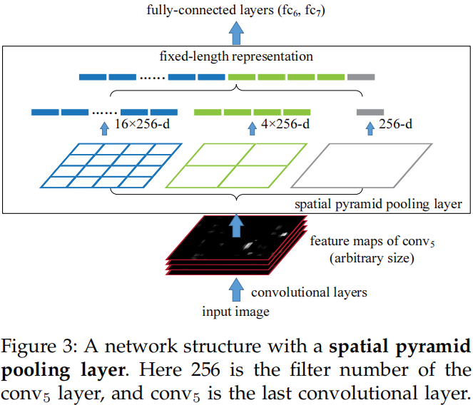

# Spatial Pyramid Pooling in Deep Convolutional Networks for Visual Recognition

ECCV 2014

## 介绍

现有的基于CNN的方法均需要固定尺寸的输入图片。当将任意尺寸的图片输入网络时，我们必须经过cropping或者warping的方法得到网络规定尺寸的图片。但是，裁剪后的图片可能并不能包含整个物体，伸缩后的图片可能导致物体的形变。所以，图片内容的损失或失真将会导致识别准确率的下降。

CNN方法之所以要求固定尺寸的图片，是因为网络的Fully-Connected层必须有事先定义好的长度的输入（一般在网络模型的最深层），而卷积层和池化层并不需要输入的长度固定。

本文提出了一种SPP层（Spatial Pyramid Pooling）来移除网络固定长度的限制。具体地，我们在最后一层卷积之上添加了SPP层，它可以池化（下采样）特征最后生成固定长度的输出，从而避免了最开始的Cropping/Warping操作。

Spatial pyramid pooling，作为词袋模型的拓展，是计算机视觉任务中最为成功的方法。它从粗粒度到细粒度对图片进行分块划分，然后聚合这些本地的特征。在CNNs模型中，我们注意到SPP有如下一些引人注目的特性：
- SPP可以生成固定长度的输出，不管输入尺寸是什么样子
- SPP使用了多种空间等级的池化，这对物体的变形有一定的抗干扰能力
- SPP可以池化从不同尺度提取的特征

SPPNet和其他网络结构是可以兼容的，并且可以提升其他网络架构的性能（还能自适应输入尺寸）。基于SPP-Net的目标检测方法可以达到和RCNN相同的准确率，但是速度相比RCNN快了24-102倍，可以做到实时检测（每张图片仅需要0.5s）。在ILSVRC 2014比赛中，我们的方法在分类任务上#3，在目标检测任务上#2。

## SPP 层

正如前面所提到的，卷积层可以接受任意尺寸的输入，生成不同尺寸的Feature Mapping，但是SVM或者FC层都需要固定长度的向量作为输入。这样的向量可以使用词袋模型生成。Spatial pyramid pooling 改进了词袋模型，由于它在本地的空间分块下池化保留了一定的空间信息。这些空间分块的尺寸和整张图片的尺寸成比例，所以分块的数量是固定的，而与图片的尺寸没有任何联系（传统的池化层的输出是依赖输入图片的尺寸的）。

为了让SPPNet适应任何尺寸的图片，我们将最后一层池化层使用SPP层来代替。SPP层的示意图如下图所示。在每个空间分块上，我们对每个特征图进行池化（全文使用的均是最大池化）。最终SPPNet层的输出为一个kM为的向量（M表示空间分块的数目，k表示特征图的数量）。这个固定维度的向量将作为FC层的输入。

## 模型训练

在单个尺寸的训练中（已知输入尺寸），对于一个n x n分块的SPP层，假设输入为 a x a，使用最大池化时，window_size = ceiling(a/n)，stride_step = flooring(a/n)。

> The main purpose of our single-size training is to **enable the multi-level pooling behavior**. Experiments show that this is one reason for the gain of accuracy.

在多尺度的训练中，假设除了224 x 224的图片以外，还有180 x 180的图片尺寸，我们直接将224 * 224的图片缩小为180 x 180，而不是人为的裁剪，这样仅仅影响图片的分辨率（内容和布局不会受到影响）。此时，我们需要重新设计SPP层的stride_step和window_size，但是这并不会增加模型参数。两个不同尺度输入图片共享参数内容，**不同的输入尺寸对应不同的SPP层stride_step和window_size**。在实际训练时，我们先在某个尺寸下训练一个epoch，然后在另外尺寸下训练完一个epoch。实验中我们发现多尺寸的训练和单尺寸的训练的收敛率类似。

>  In other words, during training we implement the varying-input-size SPP-net by two fixed-size networks that share parameters.

模型测试时，可以使用一个模型接受任意尺寸的图片的输入，得到SPP层固定长度向量输出，但同时stride_step和window_size也需要随之改变。

## SPPNet目标检测

RCNN对2000个目标候选框进行伸缩变换到227x227，然后使用CNN提取每个区域的特征。在测试阶段，特征提取是主要的时间瓶颈。而SPPNet只需要从整张图片中提取一次特征（可能在多尺寸的情况下提取），然后我们使用SPP层将候选区域所对应的特征映射池化为一个固定长度的向量表示。和之前的目标检测方法不同之处在于，我们的方法可以从**特征图**的任意大小窗口中提取相应的特征。

问题就是：如何将原图的候选区域和它产生的特征映射一一对应起来？（Mapping a Window to Feture Maps）

> 原文的实现中，我们将候选区域的角落点投影到特征图的一个像素上，使得图片中的这个角落点和特征映射像素点的感受区域的中心相隔最近。经过所有层的卷积和池化后，这个映射是复杂的。计算方法可以通过原文附录查看。（但是对应方法还是比较粗糙，从原文给出的标记框结果可以看出。）

在分类任务或者是目标检测中，SPPNet都使用了常用的Multi-Scale, Multi-Crop方法达到了较好的性能。通过各种对比实验也证实了SPPNet所使用的SPP层可以增加预测性能，同时适应各种不同尺度的输入图片（测试时比较方便）。
