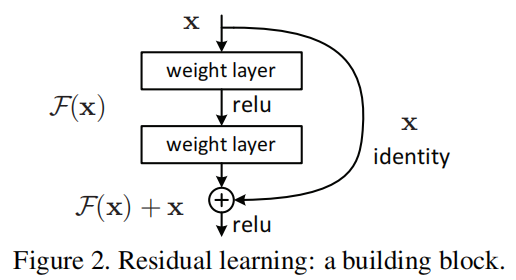

# Deep Residual Learning for Image Recognition

## 介绍

深度的卷积神经网络已经在图像分类领域取得了多项突破。深度网络以一种端到端、多层的方式自然地将低、中、高级别的特征和分类器聚合在一起，并且特征的“等级”可以随着网络的加深而进一步丰富。许多证据或实验结果显示网络的深度对于深度神经网络模型是一个非常重要的因素。

随之而来的问题是：增加更多层，是否就直接意味着网络会学习地越好？回答这个问题的障碍在于我们所诟病的梯度消失、爆炸的问题，这从一开始就阻碍了网络的收敛。然而，这个问题被正态的初始化和BN中间层所解决。

当更加深的网络开始收敛，一个随之引发的问题开始出现：随着网络的加深，准确率开始饱和，然后开始下降。不可预料的是，这样的问题不是由过拟合导致的，并且增加更多的层到网络中会导致更高的训练误差。

训练集上出现这样的问题说明了不是所有系统都是那么容易去优化。让我们考虑一个较浅的架构及其更深层次的对象，为其添加更多的层。存在一种构建更深网络的解决方法：添加的层是恒等映射，其他层是从学习到的较浅模型的拷贝。 这种构造解决方案的存在表明，较深的模型不应该产生比其对应的较浅模型更高的训练误差。但是实验表明，我们目前现有的解决方案无法找到与构建的解决方案相比相对不错或更好的解决方案（或在合理的时间内无法实现）

本文，为了解决增加深度随之引发的问题，我们提出了deep residual learning framework。不在寄希望于每个多层网络组合去直接学习预期的映射，我们让这些网络层去学习残差的映射。更加正式地，将预期要学习的映射记为H(x)，我们让增加的非线性层去学习映射f(x) = h(x) - x。所以，原始预期要学习的映射可以表示为f(x) + x。某种程度上，如果一个等价的映射是最优的，那么把残差缩小为0比增加同样的多层线性映射层要更加容易。

上述的f(x) + x 的表达式可以由前向神经网络加上“Shortcut connections”实现。“Shortcut connections” 指忽略掉1层或多层中间层。这样的修改不会增加额外的网络参数，也不会增加计算复杂性。

我们提供了ImageNet上完整的实验结果去展示上面提到的问题，同时评估我们提出的方法。我们展示的内容包括
1. 我们的深度残差网络容易优化，而未加残差连接的网络容易随着深度的增加而出现较高的训练误差。
2. 我们的深度残差网络可以更加容易地从增加网络深度中获益，从而得到比原来网络明显更好的结果。

我们使用152层（已知最深的网络）的ResNet做ImageNet分类任务，最终以3.57% 的top5-error 赢得了ILSVRC-2015分类任务的冠军。同时在ImageNet detection 和 COCO detection 等比赛中均获得了第一名。这强有力地表明了残差学习策略是通用的，同时我们希望这项技术可以在其他的视觉或非视觉任务中得到应用。

