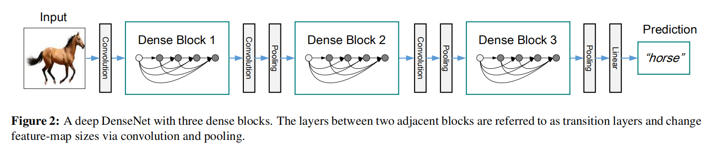

# Densely Connected Convolutional Networks

CVPR 2017 (Best Paper Award)

## 介绍

当网络结构越深时，梯度的信息会传递到许多层，最终到达最后一层时会消失。不管是ResNet，还是Highway Network，Stochastic depth，FractalNet，他们都有共同的一个特点：创建从前层到后层的短路连接。

本文提出了一种新的网络结构，将上面的见解提炼为一种简单的密集连接模式：为了保证网络中层之间的最大的信息流动，我们将所有的层彼此互相连接（带有维度匹配）。至关重要的是，和ResNet相反，我们没有把x和f(x)特征直接相加；取而代之的是，我们将这两个特征合并（concatenating）为同一个。所以，网络的第L层会有L个输入，由前面所有层的输出组成。这将会在一个L层的网络中总共产生L * (L+1) / 2 个连接。

DenseNet一个比较违反直觉的现象：它相比传统的卷积网络需要更少的参数，因为没有必要再去学习丰富的特征映射。我们提出的DenseNet架构明显地区分开了两种信息：一种是加到网络中的信息，另一种是保留的信息。DenseNet的网络层是非常窄的，仅仅添加了一小部分特征映射到网络的“协同信息”中，其余的特征映射保持不变。最终的分类器决策基于网络中所有的特征映射层。

除了更好的参数效能，DenseNet另外一个大的优点是它提升了信息和梯度在网络中的流动，这使得它很容易训练。此外，我们还观察到了密集的连接起到了正则化的效果，这降低了较小训练样本上的过拟合。

我们在四个标准数据集（Four highly competitive benchmark datasets, CIFAR-10, CIFAR-100, SVHN, and ImageNet）上评估了DenseNet的性能。我们的方法相比现有的算法在同等准确率的情况下，倾向于使用更少的网络参数。此外，在大多数训练集上，我们的方法明显地超过了SOTA的结果。

## DenseNets

正如前文所述，DenseNet是一个密集的连接，每一层的输入有前面所有层的输出组成，即：
x_l = H_l([x_0, x_1, ..., x_{l-1}])。其中[x_0, x_1, ..., x_{l-1}]表示将0到l-1层的特征映射拼接起来。为了实现的方便，我们将其拼接为一个单个的Tensor（将前层的H和W的尺寸通过Pooling下采样变换到相同时，在num_features/output_channels方向进行拼接）。

**Composite function**：受ResNet-V2 [He et.al., 2016]的影响，我们将H_l定义为三个连续操作的复合函数：BN，ReLU，3 * 3 Conv。

**Pooling layers**：当特征映射的尺寸改变时，拼接操作将不可行。所以，我们使用了Pooling层进行下采样来改变特征映射的尺寸再进行拼接。为了实施下采样，我们将网络模型分成了多个*dense blocks*，如下图所示。我们将每个块之间的层称为transition层，主要用来做卷积和池化操作。实验中，transition层由BN，1x1卷积，2x2平均池化组成。

**Growth rate**：如果每个H_l函数产生k个特征映射，那么第l层的输入特征映射个数为k_0 + k * (l - 1)，k_0表示输入的通道数目。DenseNet可以有很窄的层（对应卷积运算时Kernel的个数），如k=12。我们将超参数k称为网络的增长率。我们发现一个相对小的增长率对于取得SOTA结果来说很有效。一种解释是每一层都利用了它前层的所有信息（在这个Dense block内）。如果把特征映射当做整个网络的全局状态，网络的每一层每次都在给这个状态添加k个特征映射。

**Bottleneck layers**：我们在3x3卷积之前使用了1x1的卷积作为瓶颈层来降低输入特征映射的数目，从而提高计算效率。我们实现DenseNet时，也使用的瓶颈层，最终H_l的形式为BN-ReLU-Conv(1x1)-BN-ReLU-Conv(3x3)，这被称之为DenseNet-B。在我们的实验中，1x1的卷积产生4 * k 个特征映射。

**Compression**：为了进一步压缩模型，我们在transition层降低了特征映射层的数目。如果一个Dense Block包含m个特征映射，我们让transition层生成m * theta个特征映射，theta为一个0-1的小数。使用了Compression的DenseNet被称作DenseNet-C。当同时使用了瓶颈层和tansition层时，模型被称作DenseNet-BC。

## 实验结果

DenseNet在CIFAR和SVHN数据集上的结果如下图所示：

后文作者从以下几个方面针对实验结果进行了讨论：
- 准确率
- 模型容量
- 参数效率
- 过拟合

后面作者将DenseNet和ResNet进行了仔细的对比，有兴趣的可以阅读原文查看。
