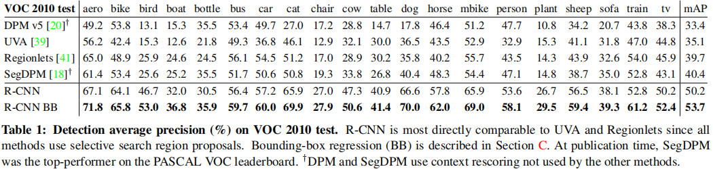
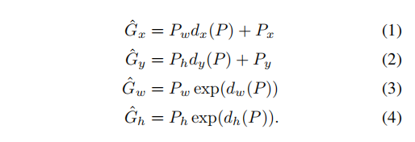
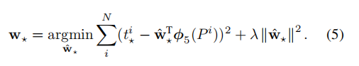
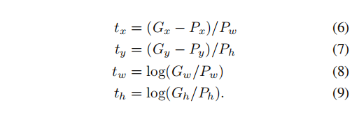

# Rich feature hierarchies for accurate object detection and semantic segmentation

## 介绍

论文首先介绍了CV领域的发展历史。2012年前，SIFT和HOG发展迅猛，后来慢慢平稳。这一类方法仅仅使用了少量的视觉特征信息。1990年，CNN得到了广泛的使用，但是很快由于SVM的崛起而变得暗淡。直到2012年的ILSVRC比赛中，CNN模型再次引发了大家的广泛关注。这一次的CNN模型在1990年CNN模型基础上，增加了很多技巧，比如RELU激活函数、dropout方法等。

在ILSVRC 2012的研讨会上，ImageNet比赛结果的意义所在被大家激烈讨论。其中一个非常核心的问题是，ImageNet数据集上的CNN分类效果可以多大程度拓展到PASCAL VOC目标识别的效果上？

本文从缩小图像分类和目标识别的差距的角度来回答这个问题。本文是第一篇展示CNN可以大幅度提高PASCAL VOC目标检测任务性能的文章。为了达到这个目的，本文重点关注两个方面：CNN定位目标，使用一小部分标记的检测数据训练大容量的网络模型。

解决定位问题的方法包括，将方框定位当做一个回归问题，或者使用滑动窗口检测器。本文提出的RCNN方法，从另外一个角度解决了目标定位的问题。在测试阶段，对于每张输入图片，我们的方法首先生成接近2000个类别无关的候选区域，然后使用CNN从每个候选区域中提取一个固定长度的特征向量。最后，使用特定类别的SVM分类器完成对候选区域的分类。对于不同规格的候选区域，我们使用了一个简单的仿射变形得到CNN要求的输入规格。

另外一个问题就是，我们的目标检测标记太少。常见的做法是使用非监督学习的预训练，接着使用监督学习进行微调。本文第二个贡献是展示了：当数据比较缺乏的时候，在大型辅助数据集ILSVRC上监督训练的大型CNN模型，然后拿到特定领域的小数据集上进行微调，是一种有效的训练CNN模型的方法。

## R-CNN目标检测

本文提出的R-CNN包括三个模块：
1. 候选区域生成：使用选择性搜索得到候选区域框；
2. CNN模型特征提取器：使用AlexNet从候选框中提取长度为4096的特征向量；
3. 多个特定类别的SVM分类器：输入4096维的特征向量，得到类别概率。

下面重点介绍模型的训练：
1. 监督预训练。我们使用ILSVRC分类数据集训练了AlexNet网络，效果比较接近AlexNet。
2. 特定任务的微调。AlexNet模型结构不变，除了将最后一层换为用于新任务的 N + 1 （N表示种类数，1表示背景这一类）的输出层外。从每张图片中提出的候选区域，如果和真实的目标框IOU值大于0.5，那么它的标签就是正的，否则就是背景区域。每一次迭代时，我们均匀地选择32张正例图片（从所有类别的图片中）和96张背景图片组成一个mini-batch。
3. 一旦特征提取完后，并且每个训练标签都已经确定了，就对每一类训练一个线性的SVM。由于数据量过大而超内存，我们采用了标准的hard negative mining method。

文章附录中讨论了为什么要在训练SVM时，使用和训练CNN模型时不同的IOU阈值来确定样本是正还是负。还讨论了为什么使用SVM得到概率值，而不是直接使用微调后的CNN最后的softmax的输出概率。

数据集PASCAL VOC 2010-12目标检测结果：

## 模型分析

该节首先可视化了模型学习的特征，然后讨论了CNN模型最后三层的每一层对模型性能的影响，比较了其他的特征学习方法。

另外，还从下面几个角度分析了模型：
- CNN模型的架构对目标检测的性能也有很大的影响。使用VGGNet后，相比原来的AlexNet架构，mAP从58.5%提升到了66.0%，但与此同时，使用了VGGNet后，前向计算的时间长了7倍。
- Bounding-Box Regression (BBR)。从DPM中使用的方法获取到灵感，我们也在R-CNN中使用了BBR。给定候选区域的Pool-5特征，我们训练了一个线性回归模型去预测新的检测窗口。该方法提升将原来模型的mAP提升了3到4个百分点。
- 样例分析，包括ILSVRC-2013数据集上随机和精选的结果。为了给读者R-CNN检测器的真实印象，见文章附录部分给出的图集。

## Bounding-Box Regression

在使用特定类别的SVM检测器对候选框进行评分后，我们使用一个特定类别的边界框预测回归模型去预测一个新的回归框用于检测。这里回归模型的输入是由CNN模型提取出来的特征。

模型的训练样本为{(P_i, G_i)|i = 1, 2, ..., n}，其中P是候选框的位置信息（中心点的坐标、长度和宽度），G表示真实框的位置信息。我们的目标是学习候选框P到真实框的映射。

我们需要学习四个回归模型，通过以下式子来完成从候选框P到预测框G_hat的变换：

这四个回归模型分别对应d_x(P)、d_y(P)、d_w(P)、d_h(P)。它们都是线性函数（ridge regression模型参数表示为W），输入P即为CNN模型pool5层输出的特征。W通过优化下面的损失函数得到：

其中回归目标t如下：

需要注意的问题有两个：一是惩罚项参数lambda的大小设置，二是用于训练样本选择（P和G的IOU值大于0.6）。
